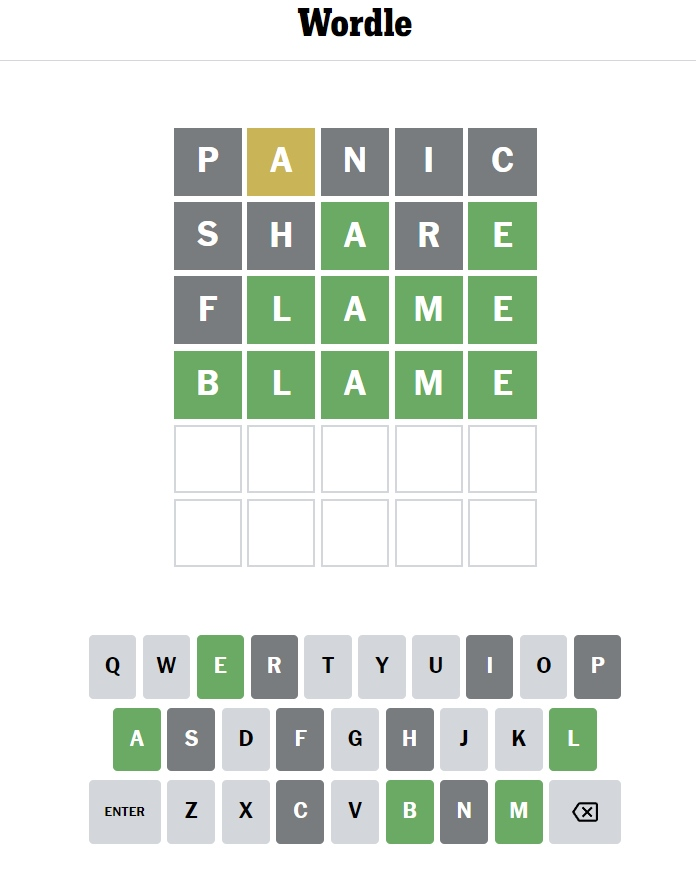

# WORDLE GAME

### Description
Wordle game is a word game. You must guess a 5-letter word from maximum 6 tries.
When you fill in the first word you will get / get not letter matches, excluded letters.
Then, at the next tries you will narrow the search by adding exact letter positions, removing 
other letters or include the letter into a wrong position.

There are 5760 5-letter words in this database. There are less 5-letter words
into the Oxford English Dictionary but here we included also the plurals.

### Source of the game
https://www.nytimes.com/games/wordle/index.html

### Example of a correct guess

